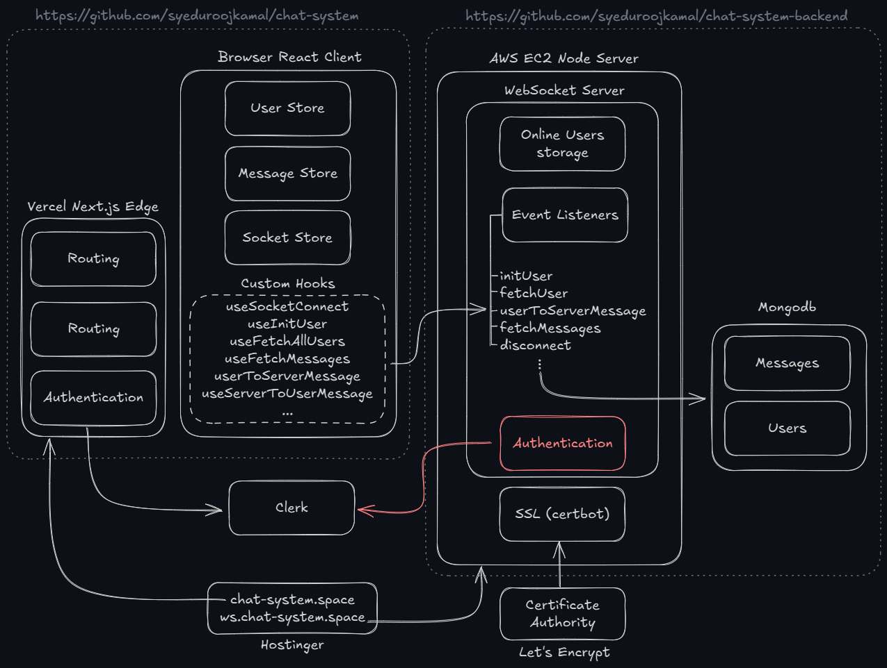

# Chat System

The backend hosted on the EC2 instance has exceeded the free tier usage limits, which has caused the site to go temporarily offline. We're working on resolving this migrating to a more scalable solution.

A clean, modular real-time chat MVP built with a modern stack. While chat apps are common, this project stands out for its code clarity, maintainability, and thoughtful architecture—showcasing my engineering skills.

## 🚀 Live Demo

Try it here: [https://chat-system.space/](https://chat-system.space/)

▶️ [11s YouTube Demo](https://youtube.com/shorts/gpyRzumcfUc)

---

## Architecture Overview

---

## Tech Stack

- **Frontend:** Next.js (TypeScript, React), TailwindCSS, shadcn, lucide-react, Zustand, Clerk (authentication)
- **Backend:** Node.js, Express, Socket.io (real-time), MongoDB (Mongoose)
- **Frontend Deployment:** Edge (Vercel/Next.js)
- **Backend Deployment:** AWS EC2 (plans for Kubernetes & Redis scalability)

## Features

- Real-time messaging (Socket.io)
- Secure authentication (Clerk)
- Modular, readable codebase (Zustand + custom hooks)
- Edge-ready frontend for scalability
- Encryption (coming soon)
- Backend repo: [syeduroojkamal/chat-system-backend](https://github.com/syeduroojkamal/chat-system-backend)

## About

- MVP, not production-ready
- Single contributor (open to strong ideas)
- Focused on code quality, scalability, and modern practices

---

> If you’re looking for a candidate with hands-on experience in Next.js, MERN stack, real-time systems, and scalable architecture, check out the code and try the demo!
